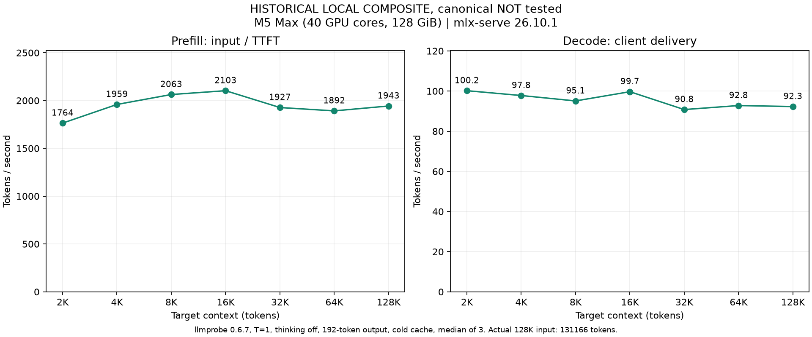

# 性能基准与测试数据 (Benchmark)

本报告详细说明 `qwen38-mlx-serving` 的性能评测方法论、标准化测量协议以及历史测试基线数据。


## 1. 结果边界与数据性质声明

> [!IMPORTANT]
> **数据性质声明：HISTORICAL LOCAL COMPOSITE, canonical NOT tested**
> - 本文档所展示的所有吞吐率与延迟数据均源自于先前在特定硬件上的**历史本地复合配置环境 (Historical Local Composite)** 测量结果。
> - 截至 2026-10-02，**规范模型权重 (Canonical Checkpoint) 尚未完成端到端实测**。
> - 历史基线仅用于为候选 Profile 的工程合理性提供参考坐标，严禁将其表述为 Canonical 的实测指标，更严禁作出任何“全球最快”等夸大宣称。


## 2. 标准化测试协议 (Benchmark Protocol)

性能评测通过子命令 `python3.12 scripts/qwen38.py benchmark` 自动化执行，严格遵循以下控制变量要求：

1. **实例独立性**：必须通过 `python3.12 scripts/qwen38.py start --cold-cache` 启动专用的独立冷缓存推理实例。
2. **冷缓存断言**：每次从响应 usage 断言 `cached_tokens == 0`；请求前后读取 `/metrics.json` 计算阶段速率。
3. **随机前缀注入**：每次测试生成至少 256-token 的随机提示词前缀，减少公共前缀，并以响应中的 cached_tokens 为准。
4. **测试梯度与采样**：
   - **上下文长度 (7 个梯度)**：`2048, 4096, 8192, 16384, 32768, 65536, 131072` (2K 到 128K)。
   - **输出 Token 数**：固定输出 `192` tokens。
   - **采样参数**：`temperature = 1.0`, `top_p = 0.95`, `top_k = 20`。
   - **重复次数**：每个上下文点执行 `3` 次，取中间值 (Median)。
5. **耗时度量解耦**：
   - 区分服务端内部计时器上报的推理耗时与客户端 HTTP 交付总耗时。
   - 分离记录首字延迟 (TTFT)、Prompt Processing (PP) 吞吐 (tok/s) 与 Decode 吞吐 (tok/s)。


## 3. 历史基线数据表 (Historical Local Composite)

以下数据来源于测试工具 `llmprobe 0.6.7` 在 Apple Silicon M5 Max (40 核 GPU, 128 GiB 统一内存) 机器上的历史复合运行记录：

> **表格属性标记：HISTORICAL LOCAL COMPOSITE, canonical NOT tested**

| 目标上下文 | Prefill tok/s | Decode tok/s |
|---:|---:|---:|
| 2K | 1764 | 100.2 |
| 4K | 1959 | 97.8 |
| 8K | 2063 | 95.1 |
| 16K | 2103 | 99.7 |
| 32K | 1927 | 90.8 |
| 64K | 1892 | 92.8 |
| 128K | 1943 | 92.3 |

128K 实际输入 131166 tokens。历史测试使用 llmprobe 0.6.7 的 thinking-off 补丁，T=1、top_p=.95、top_k=20、192-token 输出、关闭缓存，每点三次中位数。

对应的汇总数据与可视化曲线图归档于：
- 数据文件：`benchmarks/historical-composite.json`
- 可视化图：`benchmarks/historical-composite.png`


## 4. 公开参考与比较边界

[mlx-serve PR #427](https://github.com/ddalcu/mlx-serve/pull/427) 的 exact MTP 参考在约 128K 报告 98 tok/s；历史本地组合包为 92.3，差约 6%。模型组合、提示词及风扇设置不同，参考 GPU 核数未披露，128K 仅一次测量，不能据此声称全球最快。

新 wrapper 的合成提示词与 llmprobe 不同，因此新结果是独立协议，不直接拼入旧曲线。请求后保留原始 SSE、usage、请求体和计时数据；客户端交付速率与服务端阶段速率分别汇总为 median / min / max。

## 5. 测试与绘图

```bash
python3.12 scripts/qwen38.py stop
python3.12 scripts/qwen38.py start --cold-cache
.venv/bin/python scripts/qwen38.py benchmark
.venv/bin/python scripts/qwen38.py plot \
  --input ~/.local/state/qwen38-serving/benchmarks/RUN_ID/summary.json \
  --output ./results/curve.png
```

`RUN_ID` 替换为本次输出目录。benchmark 需要 tokenizers，plot 需要 matplotlib。它只接受自己的受管冷缓存实例，且 profile、端口、model 和 revision 需匹配运行记录。每请求间隔 15 秒，同一上下文重复间隔至少 60 秒；失败时保留原始响应供检查。

图中记录协议、model / revision、近似目标上下文及实际输入 tokens。完成后 `stop`，再普通 `start` 恢复 4 entries / 4GB 的缓存配置。


