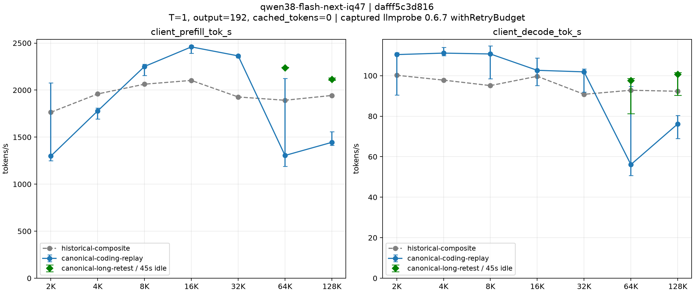
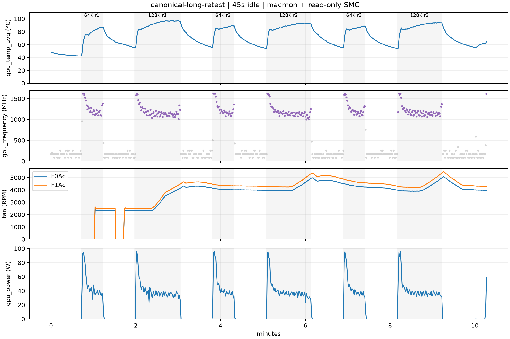

# 性能基准与测试数据 (Benchmark)

本报告详细说明 `qwen38-mlx-serving` 的性能评测方法论、标准化测量协议、历史基线数据以及完整社区模型的最新实测结果。


## 1. 结果边界与数据性质声明

> [!IMPORTANT]
> **数据性质声明：HISTORICAL LOCAL COMPOSITE 与 CANONICAL CHECKPOINT 实测边界**
> - 初次发布时仅完成离线检查，规范模型权重尚未实测。
> - 截至 2026-10-02，已在完整社区模型（`ddalcu/Qwen3.8-Flash-Next-MLX-Serve-iQ-MLX-4.7bpw`，revision `dafff5c3d8168c9d13275661153911096499a80a`）上完成两组七档测试（本地合成基准与首轮 captured llmprobe 重放对照），以及带传感器同步采样的 64K、128K 长上下文专项复测（6/6 完成）。
> - 历史基线源自先前特定硬件上的历史本地复合配置环境 (Historical Local Composite)；历史基线、首轮重放与长上下文复测数据各自独立标注，不能混淆或拼接为单一同协议曲线；当前数据不足以确认此前下降的确切物理原因，不宣称热问题已解决，也不能据此声称“全球最快”。


## 2. 标准化测试协议 (Benchmark Protocol)

性能评测通过子命令 `python3.12 scripts/qwen38.py benchmark` 自动化执行，严格遵循以下控制变量要求：

1. **实例独立性**：必须通过 `python3.12 scripts/qwen38.py start --cold-cache` 启动专用的独立冷缓存推理实例。
2. **冷缓存断言**：每次从响应 usage 断言 `cached_tokens == 0`；请求前后读取 `/metrics.json` 计算阶段速率。
3. **随机前缀注入**：每次测试生成至少 256-token 的随机提示词前缀，减少公共前缀，并以响应中的 cached_tokens 为准。
4. **测试梯度与采样**：
   - **上下文长度 (7 个梯度)**：`2048, 4096, 8192, 16384, 32768, 65536, 131072` (2K 到 128K)。
   - **输出 Token 数**：固定输出 `192` tokens。
   - **采样参数**：`temperature = 1.0`, `top_p = 0.95`, `top_k = 20`。
   - **重复次数**：每个上下文点执行 `3` 次，取中间值 (Median)。
5. **耗时度量解耦与测量定义**：
   - 区分服务端内部计时器上报的推理耗时与客户端 HTTP 交付总耗时。
   - 分离记录首字延迟 (TTFT)、Prompt Processing (PP) 吞吐 (tok/s，计算为 input tokens / TTFT) 与 Decode 吞吐 (tok/s)。
   - **Client Decode 测量口径**：Client Decode 利用首个内容帧的字符占比估算应扣除的 token 份额，不是逐 token 打点的精确计时。
   - **Profile 与冷缓存覆盖**：基准 JSON 中记录的 `profile` 为基础启动 profile，`protocol.prefix_cache_entries=0` 记录本次冷缓存覆盖值。


## 3. 历史基线数据表 (Historical Local Composite)

以下数据来源于测试工具 `llmprobe 0.6.7` 在 Apple Silicon M5 Max (40 核 GPU, 128 GiB 统一内存) 机器上的历史复合运行记录：

> **表格属性标记：HISTORICAL LOCAL COMPOSITE, canonical NOT tested**

| 目标上下文 | Prefill tok/s | Decode tok/s |
|---:|---:|---:|
| 2K | 1764 | 100.2 |
| 4K | 1959 | 97.8 |
| 8K | 2063 | 95.1 |
| 16K | 2103 | 99.7 |
| 32K | 1927 | 90.8 |
| 64K | 1892 | 92.8 |
| 128K | 1943 | 92.3 |

128K 实际输入 131166 tokens。历史测试使用 llmprobe 0.6.7 的 thinking-off 补丁，T=1、top_p=.95、top_k=20、192-token 输出、关闭缓存，每点三次中位数。

对应的汇总数据与可视化曲线图归档于：
- 数据文件：[benchmarks/historical-composite.json](../benchmarks/historical-composite.json)
- 可视化图：[benchmarks/historical-composite.png](../benchmarks/historical-composite.png)


## 4. 完整社区模型实测结果 (Canonical Checkpoint Benchmarks)

以下基准测试均在 Apple Silicon M5 Max (40 核 GPU, 128 GiB 统一内存) 上针对完整社区模型（`ddalcu/Qwen3.8-Flash-Next-MLX-Serve-iQ-MLX-4.7bpw`）实机完成，配置为 `--ctx-size 262144`、`--mtp-depth 6`、`MLX_SERVE_MTP_FORCE_DEPTH=3`、`--mtp-history-window 8192`、`--kv-quant 8`、`--mtp-head-kv-quant`、`--prefix-cache-entries 0`（冷缓存）。

### 表 1：本地合成基准测试 (Synthetic Benchmark)

> **表格属性标记：CANONICAL CHECKPOINT, LOCAL SYNTHETIC (tool: qwen38-mlx-serving-local-synthetic)**
> 提示词为 `random-prefix-LRU-implementation-v1`，T=1.0、top_p=0.95、top_k=20、输出 192 tokens、thinking=false、cached_tokens=0。**本组提示词不同于旧 llmprobe，不可直接比较。**

| 目标上下文 | 实际输入 Tokens (Prompt) | Client PP (tok/s, input/TTFT) | Client Decode (tok/s) |
|---:|---:|---:|---:|
| 2K | 2019 | 1023.8 | 77.7 |
| 4K | 4067 | 1355.8 | 83.1 |
| 8K | 8163 | 1780.8 | 81.1 |
| 16K | 16355 | 2212.9 | 75.0 |
| 32K | 32739 | 2299.4 | 76.4 |
| 64K | 65507 | 2248.3 | 63.3 |
| 128K | 131043 | 2152.9 | 67.3 |

对应的汇总数据与可视化曲线图归档于：
- 数据文件：[benchmarks/canonical-synthetic.json](../benchmarks/canonical-synthetic.json)
- 可视化图：[benchmarks/canonical-synthetic.png](../benchmarks/canonical-synthetic.png)

### 表 2：Captured llmprobe 首轮重放对照测试 (Captured llmprobe Replay Benchmark)

> **表格属性标记：CANONICAL CHECKPOINT, CAPTURED REPLAY (tool: qwen38-local-replay-of-captured-llmprobe-0.6.7-coding-requests)**
> 使用捕获的 llmprobe 0.6.7 withRetryBudget 21 个编码请求，仅将 model ID 替换为 `qwen38-flash-next-iq47`，PR427 thinking-off 补丁，T=1、top_p=0.95、top_k=20 (via generation_config)、输出 192 tokens、thinking=false、cached_tokens=0。

| 目标上下文 | 实际输入 Tokens | 历史 Prefill tok/s | 历史 Decode tok/s | Client PP (tok/s, input/TTFT) | Client Decode (tok/s) |
|---:|---:|---:|---:|---:|---:|
| 2K | 2101 | 1764 | 100.2 | 1298.5 | 110.4 |
| 4K | 4092 | 1959 | 97.8 | 1778.6 | 111.1 |
| 8K | 8255 | 2063 | 95.1 | 2251.2 | 110.7 |
| 16K | 16293 | 2103 | 99.7 | 2459.3 | 102.6 |
| 32K | 32885 | 1927 | 90.8 | 2363.9 | 101.9 |
| 64K | 65456 | 1892 | 92.8 | 1305.0 | 56.1 |
| 128K | 131166 | 1943 | 92.3 | 1444.6 | 76.2 |

对应的汇总数据与可视化曲线图归档于：
- 数据文件：[benchmarks/canonical-coding-replay.json](../benchmarks/canonical-coding-replay.json)
- 可视化图：[benchmarks/canonical-coding-replay.png](../benchmarks/canonical-coding-replay.png)

### 表 3：64K / 128K 长上下文交替复测测试 (Long-Context Retest Benchmark)

> **表格属性标记：CANONICAL CHECKPOINT, LONG-CONTEXT RETEST (tool: qwen38-canonical-long-context-retest)**
> 重启同配置独立服务，使用与表 2 相同的 captured llmprobe 64K 与 128K 编码请求。64K 与 128K 交替执行，每个请求完成后保持 45 秒空闲等待。冷前缀缓存 (cached_tokens == 0)，T=1.0、top_p=0.95、top_k=20，输出 192 tokens，thinking=false。模型权重、服务配置与系统风扇策略均未改变。共完成 3 轮完整测试（6/6 请求）。

| 目标上下文 | 实际输入 Tokens | 运行次数 | Client PP tok/s (中位数 [min, max]) | Client Decode tok/s (中位数 [min, max]) | Server PP tok/s (中位数 [min, max]) | Server Decode tok/s (中位数 [min, max]) |
|---:|---:|---:|---:|---:|---:|---:|
| 64K | 65456 | 3 | 2238.8 [2237.0, 2243.4] | 97.5 [81.3, 98.6] | 2240.7 [2239.0, 2244.8] | 99.7 [82.9, 101.0] |
| 128K | 131166 | 3 | 2114.7 [2105.9, 2130.8] | 100.6 [90.2, 101.5] | 2116.3 [2107.2, 2132.4] | 102.8 [92.1, 104.1] |

对应的汇总数据与独立综合对照图归档于：
- 数据文件：[benchmarks/canonical-long-retest.json](../benchmarks/canonical-long-retest.json)
- 综合对照图：[benchmarks/canonical-comparison.png](../benchmarks/canonical-comparison.png)（展示历史基线、首轮完整重放和本轮两点复测三条分开标注的独立 series，不拼接为单条曲线）

### 表 4：复测期间硬件传感器与热状态遥测统计 (Telemetry & Thermal Stats)

> **遥测说明**：复测期间通过系统已有 `macmon` 管道同步记录 GPU 频率、温度与功耗；风扇转速 (RPM) 通过本机 SMC 接口只读采样。表中只统计 GPU 忙碌率超过 50% 的采样，温度与频率不是热保护阈值。不在公开仓库提交私有传感器实现或日志。原始逐请求与遥测记录保存在 `~/.local/state/qwen38-serving/long-context-retest/RUN_ID/`（不使用个人绝对路径）。

| 目标上下文 | 轮次 | 样本数 | GPU 频率 MHz (中位数 [min]) | GPU 温度 °C [min, max] | GPU 功耗 W (中位数) | 风扇最大转速 RPM [F0Ac, F1Ac] |
|---:|---:|---:|---:|---:|---:|---:|
| 128K | 第 1 次 | 58 | 1144.0 [1007] | [59.2, 97.6] | 37.2 | [4107.0, 4437.0] |
| 64K | 第 1 次 | 27 | 1220.0 [1095] | [59.7, 87.2] | 40.8 | [2415.0, 2624.0] |
| 128K | 第 2 次 | 58 | 1157.0 [1000] | [63.2, 93.5] | 37.6 | [4925.0, 5306.0] |
| 64K | 第 2 次 | 27 | 1192.0 [1074] | [67.4, 89.6] | 39.1 | [4127.0, 4456.0] |
| 128K | 第 3 次 | 57 | 1163.0 [1059] | [54.3, 94.6] | 37.8 | [4938.0, 5329.0] |
| 64K | 第 3 次 | 28 | 1202.0 [1076] | [64.4, 89.1] | 39.8 | [4510.0, 4872.0] |

### 测量细节与现象分析

1. **数值口径**：表中吞吐率数值均为 3 次测定的中位数（保留 1 位小数），复测表中同时列出最小值与最大值。每次测定的完整请求体、SSE 原始记录、阶段耗时以及传感器遥测数据均保存在状态目录（`~/.local/state/qwen38-serving/benchmarks/`、`~/.local/state/qwen38-serving/matched-workload/` 与 `~/.local/state/qwen38-serving/long-context-retest/RUN_ID/`）中。
2. **2K–32K 对照表现**：在 2K 至 32K 上下文范围内，首次重放测试的 Decode 速率中位数为 101.9–111.1 tok/s，较历史组合包的 90.8–100.2 tok/s 表现更快。但短上下文 Prefill 在首次重放中（2K 为 1298.5 tok/s，4K 为 1778.6 tok/s）仍较历史基线低，不承诺所有指标全面更快。
3. **首次重放中 64K/128K 下降与历史排查案例**：在首次捕获重放测试中，64K 和 128K Decode 速率出现显著下降（分别为 56.1 tok/s 和 76.2 tok/s），且 64K 内部波动剧烈（50.6 至 94.7 tok/s）。排查记录显示：
   - 首次重放 64K 运行中，前两次的草稿命中率几乎完全相同（原始记录为 81.4% 与 81.5%），但单轮计算耗时 `round_ms` 从 34.99ms 升至 69.21ms。该轮耗时上升不能仅用草稿接受率变化解释；不过 `round_ms` 是原生引擎报告的解码轮耗时，单独这个字段不能定位物理硬件瓶颈，不能草率断定为硬件物理变慢。
   - 伴随测试期间风扇加速运转，触发了对系统热状态与动态调频的排查需求。
4. **长上下文专项复测观察**：带传感器同步记录的 64K 与 128K 各 3 轮复测（共 6/6 请求）已全部完成：
   - 未观察到更换模型权重后持续一致的 Decode 退化：在本次复测中，64K Decode 中位数回升至 97.5 tok/s（min 81.3, max 98.6），128K Decode 中位数回升至 100.6 tok/s（min 90.2, max 101.5），Prompt Processing 分别达到 2238.8 与 2114.7 tok/s。
   - 算法命中率与单轮耗时观察：在本次 64K 三次复测中，native `round_ms` 分别为 33.80ms、35.37ms 和 34.85ms，单轮耗时相对稳定；第三次 Decode 速率较慢（81.3 tok/s），同时草稿命中率由前两轮的 81.4% / 81.5% 下降至 59.5%。这表明接受率变化与第三次吞吐波动相对应，与首次重放中命中率相同但 `round_ms` 翻倍的现象有所不同；但同样需要注意，单凭 `round_ms` 无法定位物理硬件瓶颈，不能据此认为物理与内容因素已被完全解耦。
5. **协议边界与不宣称热问题已解决**：
   - **不能拼接曲线**：严禁将历史基线、首次重放以及本次长上下文复测拼成一个优化后的统一七档曲线。本次复测仅为两档测试，且改变了运行环境与协议（重启了服务进程、改为 64K 与 128K 交替运行、每个请求后引入 45 秒空闲等待）。首次完整重放的下降数据作为真实测试记录必须予以保留。
   - **既不能证实也不能排除此前热降频**：上一轮完整重放未同步记录温度、频率与风扇数据；而本轮复测同时改变了服务实例、执行顺序和空闲等待时间。后续 97.5 / 100.6 tok/s 的复测是在重启服务、64K/128K 交替执行且每请求后留出 45 秒空闲等待的特定条件下测得，不能证明热降频就是此前下降的根本原因，更不能保证持续满载运行下始终达到 100 tok/s。因此，当前数据既不能确认、也不能排除上一轮长上下文下降是由热降频所致，**绝不宣称热问题已解决**。
   - **散热与负载边界**：复测期间风扇转速明显升高（128K 最高转速超过 5300 RPM，64K 亦达到 4800+ RPM），温度峰值达 97.6°C，GPU 忙碌率超过 50% 的负载采样中，各请求的频率中位数为 1144–1220 MHz（所有温度与频率均为采样值）。机器风扇仍由 macOS 默认策略调度。本次复测通过仅证明在带 45 秒空闲交替协议下长上下文能恢复较高吞吐，**不保证任意任务或真实长时高负载下均能达到 100 tok/s**；完整 262K 上下文、持续无空闲高负载以及更广泛的生成质量基准均未经过验证。
6. **遥测方法与开源边界**：
   - 硬件指标采集通过系统已有 `macmon` 管道记录 GPU 核心频率、温度与功耗；风扇转速 (RPM) 通过本机 SMC 接口只读采样。
   - 保持公共仓库整洁与安全边界，不在公开仓库中提交私有传感器实现、SMC 探针脚本或机器原始日志文件。


## 5. 公开参考与比较边界

[mlx-serve PR #427](https://github.com/ddalcu/mlx-serve/pull/427) 的 exact MTP 参考在约 128K 报告 98 tok/s；历史本地组合包为 92.3，差约 6%。模型组合、提示词及风扇设置不同，参考 GPU 核数未披露，128K 仅一次测量，不能据此声称全球最快。

新 wrapper 的合成提示词与 llmprobe 不同，因此新结果是独立协议，不直接拼入旧曲线。请求后保留原始 SSE、usage、请求体和计时数据；客户端交付速率与服务端阶段速率分别汇总为 median / min / max。

公开 CLI（`python3.12 scripts/qwen38.py benchmark`）仅用于复现本地 synthetic 协议测试。captured llmprobe 复测所使用的历史完整请求与临时传感器采集脚本属于私有历史环境，未包含在公开仓库中，因此当前公开材料不能逐字重放那些历史请求。


## 6. 测试与绘图

```bash
python3.12 scripts/qwen38.py stop
python3.12 scripts/qwen38.py start --cold-cache
.venv/bin/python scripts/qwen38.py benchmark
.venv/bin/python scripts/qwen38.py plot \
  --input ~/.local/state/qwen38-serving/benchmarks/RUN_ID/summary.json \
  --output ./results/curve.png
```

`RUN_ID` 替换为本次输出目录。benchmark 需要 tokenizers，plot 需要 matplotlib。它只接受自己的受管冷缓存实例，且 profile、端口、model 和 revision 需匹配运行记录。每请求间隔 15 秒，同一上下文重复间隔至少 60 秒；失败时保留原始响应供检查。

图中记录协议、model / revision、近似目标上下文及实际输入 tokens。完成后 `stop`，再普通 `start` 恢复 4 entries / 4GB 的缓存配置。




